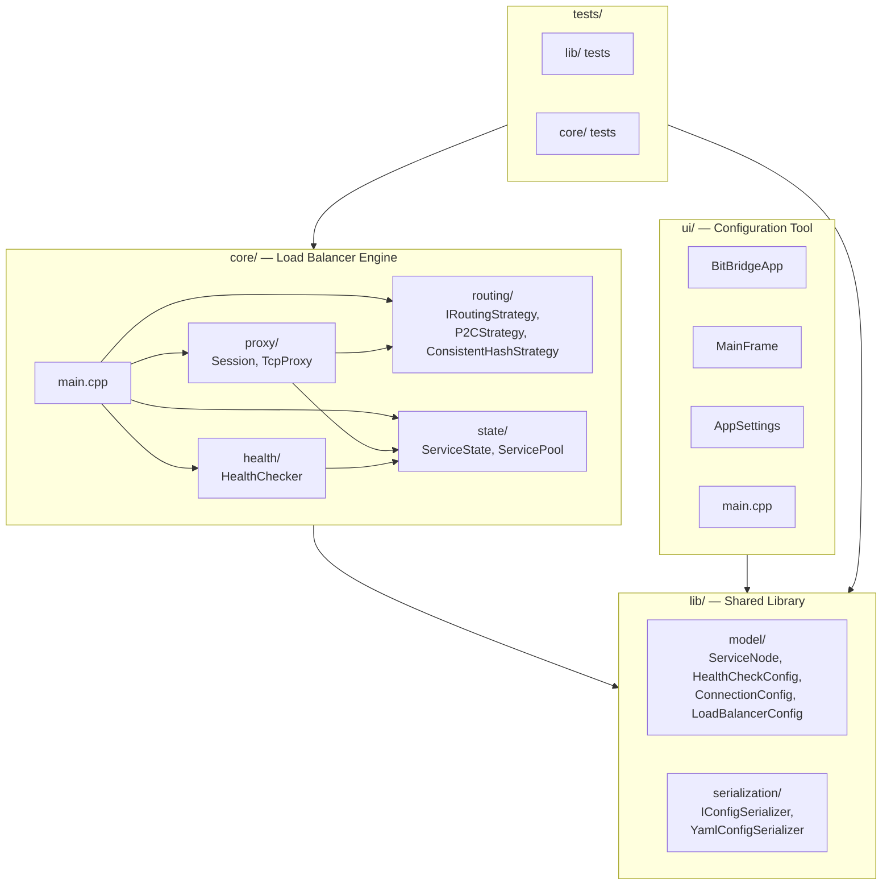

# Bit Bridge

Simple Layer 4 TCP Load Balancer + Configuration Tool


## Architecture



## Features

- **Power of Two Choices (P2C)** — O(1) load-aware routing, picks the lighter of two random healthy backends
- **Consistent Hash Ring** — O(log n) affinity-based routing with 150 virtual nodes per backend and FNV-1a hashing
- **Active Health Checks** — timer-based TCP connect probes with configurable thresholds
- **Full-Duplex TCP Proxy** — async bidirectional data relay via Boost.Asio
- **Graceful Shutdown** — SIGINT/SIGTERM handling, drains existing connections
- **wxWidgets Config UI** — desktop tool for creating and editing YAML load balancer configurations
- **CI Benchmarks** — automated performance regression detection on every PR

## Build

### Dependencies

| Library | Purpose |
|---------|---------|
| wxWidgets 3.2 | UI framework |
| yaml-cpp | YAML config serialization |
| tomlplusplus | TOML UI settings |
| Boost.Asio | Async TCP networking |
| Google Test | Unit testing |

### macOS

```bash
brew install wxwidgets yaml-cpp boost cmake
# tomlplusplus and googletest are built from source via CMake
make build
```

### Linux (Ubuntu 24.04)

```bash
sudo apt install g++-14 cmake make libwxgtk3.2-dev libyaml-cpp-dev libboost-dev
# tomlplusplus and googletest are built from source via CMake
make build
```

## Usage

### Configuration UI

```bash
make run
```

Opens the desktop configuration tool for creating and editing load balancer YAML configs.

### Load Balancer

```bash
make run-lb
# or with a custom config:
make run-lb ARGS="path/to/config.yaml"
```

Starts the TCP load balancer reading from the specified YAML configuration.

### Example Config

```yaml
name: my-cluster
listenAddress: "0.0.0.0"
listenPort: 8080
routingAlgorithm: "p2c"
services:
  - name: backend-1
    ip: "127.0.0.1"
    port: 9001
    weight: 1
  - name: backend-2
    ip: "127.0.0.1"
    port: 9002
    weight: 1
healthCheck:
  enabled: true
  intervalMs: 5000
  timeoutMs: 2000
  unhealthyThreshold: 3
connection:
  maxPerService: 1024
  idleTimeoutMs: 30000
  connectTimeoutMs: 5000
```

### Testing

```bash
make test          # Run all tests
make test-lib      # Run lib/ tests only
make test-core     # Run core/ tests only
make test-asan     # Run tests with AddressSanitizer
make lint          # Static analysis with clang-tidy
```

## Third-Party Libraries

| Library | Version | License | Usage |
|---------|---------|---------|-------|
| [wxWidgets](https://www.wxwidgets.org/) | 3.2 | wxWindows Library Licence | Desktop UI framework |
| [yaml-cpp](https://github.com/jbeder/yaml-cpp) | 0.8+ | MIT | YAML configuration serialization |
| [tomlplusplus](https://github.com/marzer/tomlplusplus) | 3.4.0 | MIT | TOML UI settings persistence |
| [Boost.Asio](https://www.boost.org/doc/libs/release/doc/html/boost_asio.html) | 1.83+ | Boost Software License | Async TCP networking |
| [Google Test](https://github.com/google/googletest) | 1.17.0 | BSD-3-Clause | Unit testing framework |
| FNV-1a | — | Public Domain | 64-bit hash for consistent hash ring |