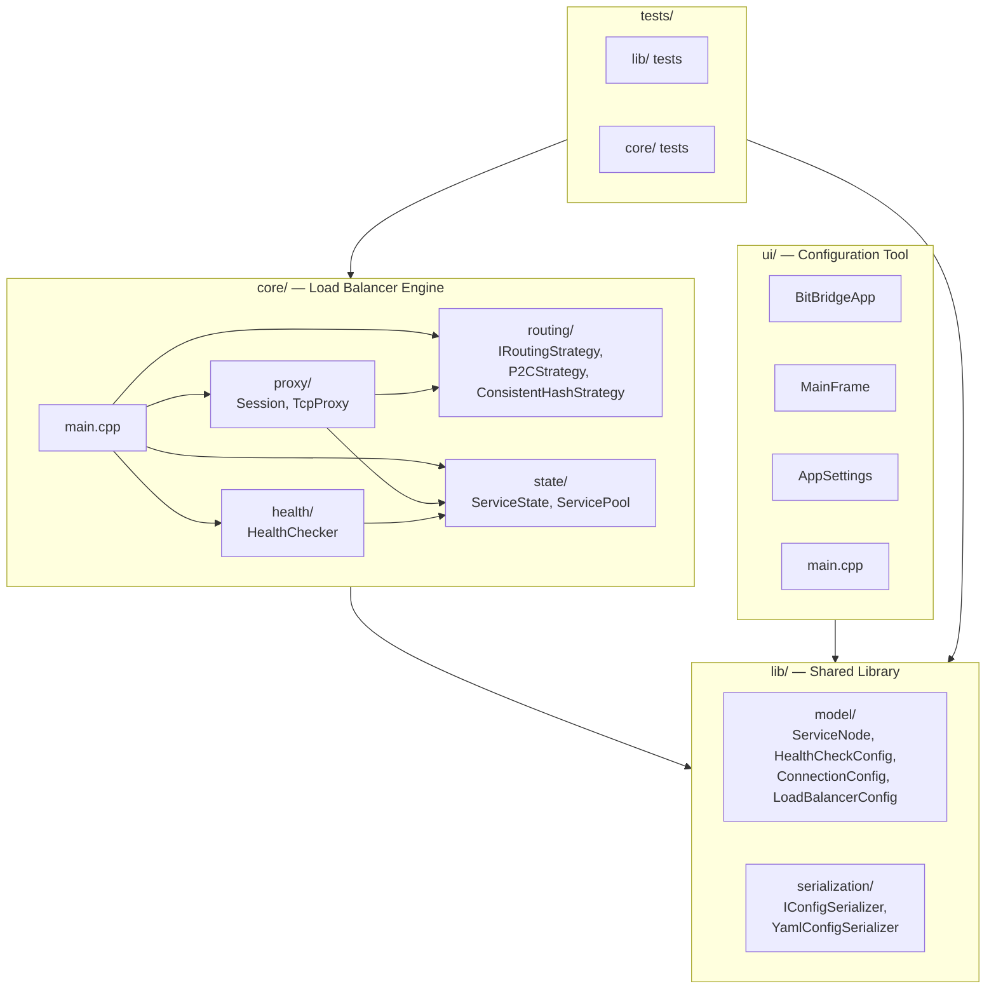

# Bit Bridge

A simple Layer 4 TCP load balancer in C++23 with a configuration tool.
Routes connections across services via **Power of Two Choices** or **Consistent Hash Ring**, with active health checking and graceful shutdown — powered by Boost.Asio.

<table>
  <tr>
    <td></td>
    <td></td>
  </tr>
</table>

## Architecture



## Features

- **Power of Two Choices (P2C)** — O(1) load-aware routing, picks the lighter of two random healthy services
- **Consistent Hash Ring** — O(log n) affinity-based routing with 150 virtual nodes per service and FNV-1a hashing
- **Active Health Checks** — timer-based TCP connect probes with configurable interval, timeout, and unhealthy threshold
- **Full-Duplex TCP Proxy** — async bidirectional data relay via Boost.Asio with connect and idle timeouts
- **Graceful Shutdown** — SIGINT/SIGTERM handling, drains existing connections before exit
- **CI Benchmarks** — automated performance regression detection on every pull request
- **wxWidgets Config UI** — desktop tool for creating and editing YAML load balancer configurations

## Build

### Dependencies

| Library | Purpose |
|---------|---------|
| wxWidgets 3.2 | UI framework |
| yaml-cpp | YAML config serialization |
| tomlplusplus | TOML UI settings |
| Boost.Asio | Async TCP networking |
| Google Test | Unit testing |

### macOS

```bash
brew install wxwidgets yaml-cpp boost cmake
# tomlplusplus and googletest are built from source via CMake
make build
```

### Linux (Ubuntu 24.04)

```bash
sudo apt install g++-14 cmake make libwxgtk3.2-dev libyaml-cpp-dev libboost-dev
# tomlplusplus and googletest are built from source via CMake
make build
```

## Usage

### Configuration UI

```bash
make run
```

Opens the desktop configuration tool for creating and editing load balancer YAML configs. The UI reads default values from `bitbridge-settings.toml` and saves configurations as YAML files that the load balancer binary can consume.

### Load Balancer

```bash
make run-lb
# or with a custom config:
make run-lb ARGS="path/to/config.yaml"
```

Starts the TCP load balancer reading from the specified YAML configuration. By default it reads `bitbridge-config.yaml` in the project root.

### Pre-Built Binaries

Pre-built binaries for Linux (amd64/arm64) are available from the [GitHub Releases](https://github.com/louis-kauer/bit-bridge/releases) page.

```bash
# Configuration UI (requires wxWidgets installed)
./bit_bridge-linux-amd64

# Load Balancer
./bit_bridge_lb-linux-amd64 bitbridge-config.yaml
```

A sample `bitbridge-config.yaml` is provided in the Example Config section below.

### Load Balancer (Docker)

The LB is also available as a container image:

```bash
docker run -v ./config.yaml:/etc/bit-bridge/config.yaml \
  -p 8080:8080 \
  ghcr.io/louis-kauer/bit-bridge:latest
```

Or with a specific version:

```bash
docker run -v ./config.yaml:/etc/bit-bridge/config.yaml \
  -p 8080:8080 \
  ghcr.io/louis-kauer/bit-bridge:v0.1.0-alpha
```

Multi-arch images are published for `linux/amd64` and `linux/arm64`.

### Example Config

```yaml
name: my-bit-bridge-lb
listenAddress: 127.0.0.1
listenPort: 8080
routingAlgorithm: p2c
healthCheck:
  enabled: false
  intervalMs: 5000
  timeoutMs: 2000
  unhealthyThreshold: 3
connection:
  maxPerService: 10
  idleTimeoutMs: 5000
  connectTimeoutMs: 1000
services:
  - name: service-1
    ip: 127.0.0.1
    port: 9001
    weight: 1
  - name: service-2
    ip: 127.0.0.1
    port: 9002
    weight: 1
```

### Running Locally with Custom Services

To test the load balancer end-to-end on your machine, start a few simple TCP services (e.g. using `nc` or any HTTP server), then point the LB at them:

1. Start two echo services in separate terminals:
   ```bash
   # Terminal 1
   while true; do echo -e "HTTP/1.1 200 OK\r\n\r\nHello from 9001" | nc -l 9001; done

   # Terminal 2
   while true; do echo -e "HTTP/1.1 200 OK\r\n\r\nHello from 9002" | nc -l 9002; done
   ```

2. Create a config file (or use the UI to generate one) with `listenPort: 8080` and the two services on ports 9001 and 9002.

3. Start the load balancer:
   ```bash
   make run-lb
   ```

4. Send requests through the LB:
   ```bash
   curl http://127.0.0.1:8080
   ```

   Each request is routed to one of the services based on the configured algorithm. With P2C, the LB picks the service with fewer active connections. With consistent-hash, the same client IP always maps to the same service.

5. Kill one of the `nc` processes — the health checker (if enabled) will mark it unhealthy after the configured threshold, and new connections will route to the remaining healthy service.

### Benchmarks

The project includes a C++ benchmark tool that spins up mock TCP services, starts the LB as a subprocess, and measures throughput and latency under concurrent load.

```bash
# Run benchmarks for both algorithms
make bench-cpp

# Compare against the stored baseline (fails on >15% regression)
make bench-cpp-compare

# Save a new baseline after comparison
make bench-cpp-update
```

Options can be customized via environment variables:

```bash
CPP_REQUESTS=5000 CPP_CONCURRENCY=100 CPP_SERVICES=5 make bench-cpp
```

### Testing

```bash
make test          # Run all tests
make test-lib      # Run lib/ tests only
make test-core     # Run core/ tests only
make test-asan     # Run tests with AddressSanitizer
make lint          # Static analysis with clang-tidy
```

## Third-Party Libraries

| Library | Version | License | Usage |
|---------|---------|---------|-------|
| [wxWidgets](https://www.wxwidgets.org/) | 3.2 | wxWindows Library Licence | Desktop UI framework |
| [yaml-cpp](https://github.com/jbeder/yaml-cpp) | 0.8+ | MIT | YAML configuration serialization |
| [tomlplusplus](https://github.com/marzer/tomlplusplus) | 3.4.0 | MIT | TOML UI settings persistence |
| [Boost.Asio](https://www.boost.org/doc/libs/release/doc/html/boost_asio.html) | 1.83+ | Boost Software License | Async TCP networking |
| [Google Test](https://github.com/google/googletest) | 1.17.0 | BSD-3-Clause | Unit testing framework |
| FNV-1a | — | Public Domain | 64-bit hash for consistent hash ring |
